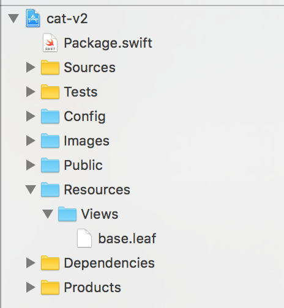
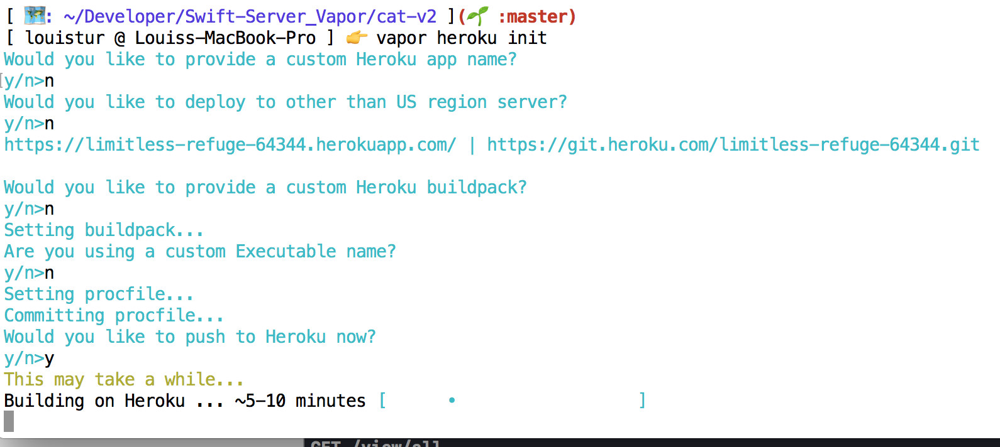

# AC3.2-Server-Side-Swift-Vapor-IV
Creating a webpage with Leaf and Deploying to Heroku

### Resources

1. [Using Leaf](https://docs.vapor.codes/2.0/leaf/package/)
2. [Templating with Leaf - RW](https://videos.raywenderlich.com/screencasts/511-server-side-swift-with-vapor-templating-with-leaf)
3. [Deploying to Heroku - RW](https://videos.raywenderlich.com/screencasts/516-server-side-swift-with-vapor-deploying-to-heroku-with-postgresql)

### Helpful Resources:
1. [Vapor - Big Nerd Ranch](https://www.bignerdranch.com/blog/server-side-swift-with-vapor/)
2. [Building Your First Web App in Swift - AppCoda](http://www.appcoda.com/server-side-swift-vapor/)

### API Reference: 
1. [Vapor API Reference](http://api.vapor.codes/)

---

### Leaf

Leaf is a templating language that you'll use in conjunction with HTML to generate views and display data dynamically in your Vapor projects. 

#### Getting Leaf into your Project:

1. Just with any Vapor package, go into `Package.swift` and add this line to your dependacies:
	- `.Package(url: "https://github.com/vapor/leaf-provider.git", majorVersion: 1)`
2. Rebuild your Vapor project with:
	- `$ vapor update` and regenerate your Xcode project when prompted in the terminal
3. Go into `Config/droplet.json` and add:
	- `"view": "leaf"`
4. Configure your `Config+Setup.swift` file by adding:
	- `import LeafProvider` and
	- `try addProvider(LeafProvider.Provider.self)` in your `setupProviders()` method
5. Create a new folder, `Resources`, and then another one named `Views` in that one.
6. Create a new file named `base.leaf` inside of `Reources/Views`



#### Hello, Leaf!

We're going to start off with some basics, so inside of your `base.leaf` file, add in:

```html
<!DOCTYPE html>
<html lang="en">
  
  <head>
    Hello, Leaf!
  </head>
  
  <body> </body>
  
</html>
```

> Note: You can get HTML syntax hightlighting for this file by going into `Editor > Syntax Coloring > HTML`


To get to this new page we've created, we'll need to create a route to it just like any other resource in our project.

1. Create a new file `CatPageController.swift`
2. Add it to the `App` target only, and place it in the `Sources/App/Controllers` folder
3. And lastly add this code to `CatPageController`: 

```swift 
import Foundation
import Vapor

final class CatPageController {
  private let drop: Droplet!
  
  init(drop: Droplet) {
    self.drop = drop
  }
  
  func setupRoutes() {
    // this lets us group our route by a common path component
    let views = self.drop.grouped("view")
    
    // this handles /view
    views.get("", handler: index)
  }
  
  func index(request: Request) throws -> ResponseRepresentable {
    return "Add code here shortly"
  }
}
```

The leaf page we're looking to generate needs to be returned from our `index` handler just like any other resource in Vapor, and here's what that looks like:

```swift
	func index(request: Request) throws -> ResponseRepresentable {
    	// "base" here is the name of the leaf file you want to display, for
    	// leaf files, you can omit the extension
    	return try self.drop.view.make("base")
  	}
```

The LeafProvider will render the page as HTML and display it in your browser. We just need to make sure to add this new route to our `Droplet`, so in `Config+Setup` in `addRoutes(drop:)` add in: 

```swift
	public func addRoutes(drop: Droplet) {
    	let catController = CatsController()
    	catController.addRoutes(drop: drop)
    
    	// these are the new lines to add
    	let catPageController = CatPageController(drop: drop)
    	catPageController.setupRoutes()
  	}
```

Run your project, and head on over to `localhost:8080/view` in your browser.


### Templating 

Let's say we didn't want our page to say "Hello, Leaf!" everytime you got there, and instead wanted to have a bit of randomness. The `make()` function has an optional parameter that takes in a type `Node`. You can pass in information to your leaf page using this parameter. Think of it as the `userInfo` property of an `NSNotification`, where you pass in some dictionary of values to later unpack. 

```swift
	func index(request: Request) throws -> ResponseRepresentable {
    	let phrases = ["Bienvenue", "Welcome", "Velkommen", "Willkommen", "Добро пожаловат", "ようこそ"]
    	let randomPhrase = phrases[Int(arc4random_uniform(UInt32(phrases.count)))].appending(", Leaf!")
    
    	return try self.drop.view.make("base", Node(node: ["welcome": randomPhrase]))
  }
```

#### Leaf Syntax

Leaf has a set of provided tags that it uses to display data dynamically. From the [Leaf doc](https://docs.vapor.codes/2.0/leaf/leaf/):

- #()
- #(variable)
- #import("template")
- #export("link") { <a href="#()"></a> }
- #index(friends, "0")
- #loop(friends, "friend") { <li>#(friend.name)</li> }
- #raw() { <a href="#raw">Anything goes!@#%^&*</a> }

In order to access our passed in data, we'll need to use the `#()` syntax, along with the name of the key we used:

```html
<!DOCTYPE html>
<html lang="en">
  <head>
    #(welcome)
  </head>
  <body></body>
</html>
```

Now, rerun the project and go to `localhost:8080/view` and reload the page a few times. 


**Exercise**
1. Create a new route that accepts an additional parameter (something like `/view/:name`) 
2. Have this route display `Hello, <name>`, replacing `<name>` with the passed parameter inside the `<body>` tags.
3. Extra: Do a check inside of the `<body>` tag to first check to see if there exists a key that corresponds to `<name>`. If there is, display `Hello, <name>` as stated. Otherwise, display `Hello, Stranger!`. *You will need to use the `#if() ##else()` tags to do this.*

#### Looping through data

I'm thinking that we're going to want to display all of our `Cat`s on this page now that we have persistent storage. So how do we accomplish this? With the `#loop()` tag. Let's first create our route in `CatPageController`: 

```swift
	func setupRoutes() {
		// this lets us group our route by a common path component
    	let views = self.drop.grouped("view")
    
    	// this handles /view
    	views.get("", handler: index)
    	
    	// handles /view/all
		views.get("all", hander: all)
	}

  	func all(request: Request) throws -> ResponseRepresentable {
    	// query all of our cats
    	let cats =  try Cat.all().makeJSON()
    
    	// return our base.leaf, passing it some content in a Node
    	return try self.drop.view.make("base", Node(node: ["content": cats]))
  	}
```

And now back in `base.leaf`:

```html
<!DOCTYPE html>
<html lang="en">
	<head>
    	#(welcome)
  	</head>
  
  	<body>
  		<!-- 
  			#loop() has two params:
  			- The first is the key of the Node value that you want to access  
			- The second is the name you want to give to use as a local var in each iteration
  		-->
    	#loop(content, "cat") {
    		<!--  
				From inside of the loop, call your vars normally, using the #() tag syntax.
				To access specific properties of your objects, use dot notation
    		-->
      		<h4>Hello, #(cat.name)!</h4>
      		According to our records, you are a #(cat.breed) who likes #(cat.snack)
    	}
  	</body>
</html>

```
Rerun your project and check out `localhost:8080/view/all`


#### How to Organize Leaf files

Leaf provides a tremendously useful tag for organizing your code, `#embed()`. `#embed()` is used to *embed* the contents of another leaf file.  

Create two new leaf files, `head.leaf` and `body.leaf`. Cut/paste the code in your `<head>` tags from `base.leaf` and put it into `head.leaf`; do the same for `<body>` and `body.leaf`. Now replace the contents of `base.leaf` with:

```html
<!DOCTYPE html>
<html lang="en">
  
  	<head>
 		#embed("head")
 	</head>
 	<body>
 		#embed("body")
 	</body>
  
</html>

```

And rerun the project. **Notice that there's no difference in the page's output!**

---

### [Heroku](https://www.heroku.com)

> Make sure you've already signed up for an account and installed the [Heroku CLI](https://devcenter.heroku.com/articles/heroku-cli) before doing this section. To test if its installed, run `$ heroku --version`. Also, be sure you sign into your account in the `CLI` with `$ heroku login`.

Deploying to the web is much easier than you think. All you'll need to do is:

1. Go to the root of your project and run `$ vapor heroku init`
	- At this point, if you have uncommitted changes you will be prompted to commit them
  - 
2. You'll be asked a few questions at the propmt:
	- Would you like to provide a custom name? n
	- Would you like to deploy to other than US region server? n
	- Would you like to provide a custom Heroku buildpack? n
	- Are you using a custom Executable name? n
	- Would you like the push to Heroku now? y
3. Now it will take some time for your project to push up to Heroku
  - 
4. When the process finishes, you should be able to go to your heroku dashboard and see the project you've just uploaded. Click on it, and select the button that says "Open App"
5. Congrats, you've uploaded your first Vapor project to heroku!

